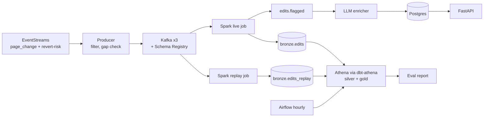

# EditGuard

Real-time triage of Wikipedia edits that anti-vandal bots miss, measured against Wikimedia's own revert-risk model.

> Demo video: `<link after M8>` · Results: [docs/results.md](docs/results.md) · Design: [docs/design.md](docs/design.md)

## Why

Volunteer patrollers cannot review every Wikipedia edit. Bots such as ClueBot NG catch obvious vandalism on English Wikipedia only. EditGuard ranks the remaining edits within seconds and explains each flag, so a patroller reviews a short list instead of everything.

## Results

Generated by `make report`. Do not edit by hand.

| Metric | EditGuard | Wikimedia baseline | Difference (95% CI) |
| --- | --- | --- | --- |
| Recall at 2% review budget, English Wikipedia, bot-miss edits | `<TBD>` | `<TBD>` | `<TBD>` |
| Same, pooled Indian-language wikis (bn, hi, kn, ml, mr, ta, te) | `<TBD>` | `<TBD>` | `<TBD>` |
| Flag latency p95 | `<TBD>` | | |
| Cost per 1,000 flagged edits | `<TBD>` | | |

Hardware: `<chip, RAM, Docker memory>` · Label snapshot: `<Iceberg snapshot ID>` · Score version: `<version>`

## Architecture



Streaming only where latency matters (flags). Corrections, labels, gold tables and evaluation run hourly on Athena. Each table has exactly one writer.

## Stack

Kafka 4.3 · Confluent Schema Registry · Spark Structured Streaming 4.1 · Apache Iceberg 1.11 (format v2) · AWS S3, Glue, Athena · dbt (athena, duckdb) · Airflow 3.3 · Postgres 18 · FastAPI · LangChain, Ollama, Claude Haiku 4.5 · Databricks + MLflow · Prometheus, Grafana, Loki · Terraform · GitHub Actions. Reasons for each: [docs/design.md](docs/design.md#tech-stack) and [docs/adr/](docs/adr/).

## Quickstart

Requirements: macOS on Apple Silicon, Docker Desktop (10 to 12 GB memory), `uv`, Homebrew, an AWS account with SSO.

```bash
brew install openjdk@17 terraform awscli
git clone https://github.com/<you>/editguard && cd editguard
cp .env.example .env          # set AWS profile, bucket, region
make setup                    # uv sync, pre-commit install
make infra ENV=dev            # terraform apply
make up                       # Kafka, Schema Registry, Postgres, Grafana
make stream                   # producer + Spark live job
make demo                     # replay a fixture and open the triage page
```

Full setup: [CONTRIBUTING.md](CONTRIBUTING.md). Operations: [docs/runbook.md](docs/runbook.md).

## Using it

Open `http://localhost:8000` with your API key. The triage page lists flagged edits by score. Each row links to the diff on Wikipedia and shows the LLM's reason. Mark a flag Correct or Wrong to record reviewer feedback. API reference: [docs/openapi.yaml](docs/openapi.yaml) or `http://localhost:8000/docs`.

## Guarantees

Effectively-once: at-least-once delivery plus idempotent writes at every hop. Not exactly-once. Details: [docs/design.md](docs/design.md#8-guarantees).

## Responsible use

Flags are suggestions for humans. Nothing is reverted automatically. No IP addresses, no per-user rankings, usernames hashed in analytics, suppressed revisions purged. Details: [docs/security.md](docs/security.md).

## Limitations

- One Mac: three Kafka brokers show replication behaviour, not real high availability.
- SLOs measure a laptop, only inside declared run windows.
- Indian-language results are pooled; only Bengali has enough data alone.
- A revert is a proxy for damage; label noise measured only in languages the author reads.
- New page creations are out of scope.
- The source has no SLA and keeps about 7 days of history.

## Docs

| Document | Purpose |
| --- | --- |
| [design.md](docs/design.md) | Requirements, architecture, data model, risks |
| [adr/](docs/adr/) | Architecture decisions |
| [data-dictionary.md](docs/data-dictionary.md) | Every field |
| [edits.odcs.yaml](contracts/edits.odcs.yaml) | Data contract |
| [openapi.yaml](docs/openapi.yaml) | API spec |
| [testing.md](docs/testing.md) | Test strategy and traceability |
| [runbook.md](docs/runbook.md) | Operate, alerts, restore, rollback |
| [security.md](docs/security.md) | Threat model and responsible use |
| [results.md](docs/results.md) | Evaluation report |
| [postmortems/](docs/postmortems/) | Incidents while building |
| [retro.md](docs/retro.md) | Retrospective |

## Data and licence

Edit data from Wikimedia EventStreams. Diff excerpts are CC BY-SA 4.0 and link back to their revisions. Code: MIT.
