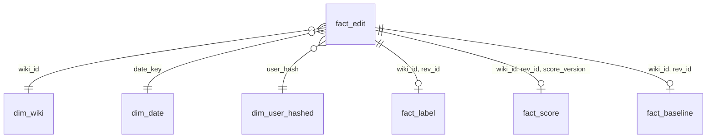

# EditGuard design

Status: frozen 2026-09-25. Changes only through a new ADR or a failed day-1 test.

## 1. Problem

Volunteer patrollers cannot review every Wikipedia edit, and bots catch only obvious vandalism, mostly on English Wikipedia. EditGuard ranks the rest so patrollers review a short, explained list.

- **User:** Wikipedia patrollers (volunteers who review recent edits).
- **Headline metric:** recall at a 2% review budget on English Wikipedia edits that bots did not revert within 5 minutes, compared with Wikimedia's revert-risk model on the same edits (paired bootstrap, 95% interval).
- **Secondary metric:** the same, pooled across bn, hi, kn, ml, mr, ta, te Wikipedias.

### Definition of success

- Flags reach patrollers within 60 s (p95) of the edit.
- Zero duplicate edits and zero upstream gaps during run windows.
- Headline metric reported with a 95% interval and reproducible from one command.
- AWS under $5/month; LLM under $1/day.

## 2. Requirements

### Functional

1. Ingest every edit on the 8 target wikis from the public stream, with no gaps across restarts.
2. Score each non-bot article edit and publish flags to `edits.flagged` within seconds.
3. Explain each flag in plain language (LLM), per language group.
4. Serve a ranked queue and per-edit detail through an API and a web page.
5. Label edits from later reverts and produce a reproducible evaluation report against Wikimedia's model.
6. Replay past days through a separate path for backtesting.
7. Hide and purge revisions that Wikipedia admins suppress.

### Non-functional

| Area | Requirement |
| --- | --- |
| Speed | Flag latency < 60 s p95; enrichment < 3 min p95 |
| Correctness | Zero duplicates, zero gaps; effectively-once |
| Scale | Full stream (~16 events/s) plus a 10x replay burst on one Mac |
| Cost | < $5/month AWS; < $1/day LLM |
| Security | No long-lived keys; least-privilege IAM; no secrets in git; API key required |
| Privacy | No IPs; no per-user rankings; usernames hashed in analytics |
| Reliability | Survives producer, Spark, Ollama and single-broker failures without data loss |
| Operability | Every alert links to a runbook step; every reported number generated by a script |

### Constraints

| Constraint | Value |
| --- | --- |
| Budget | Near zero; AWS credits; $5 budget alert |
| Time | No fixed deadline; milestones in order |
| Team | One junior data engineer |
| Hardware | One Apple Silicon Mac, Docker Desktop 10 to 12 GB |
| External | Wikimedia public APIs and rate limits; no write access to Wikipedia |

## 3. Scope

| v1 | v2 | Out of scope |
| --- | --- | --- |
| Safe-resume producer, gap check, DLQ | `/ask` endpoint | Page creations |
| Kafka x3 + Schema Registry | Similar-edit search (pgvector) | Other wikis |
| Live + replay Spark jobs | Per-wiki Indian-language numbers | Automatic reverts |
| Athena silver + gold star schema | | Public hosting |
| Revert labels + evaluation | | Snowflake, Redshift, Kubernetes |
| LLM enricher with evals | | |
| Databricks model + MLflow | | |
| Write-audit-publish demo | | |
| Contracts, CI/CD, Terraform, SLOs, logs | | |
| Chaos, load and security tests | | |

**MVP:** producer → Kafka → Spark live job → `bronze.edits` → rule score → `edits.flagged` → DuckDB query of top flags.

## 4. Existing solutions

| Tool | What it does | Gap EditGuard targets |
| --- | --- | --- |
| ClueBot NG | ML bot auto-reverting obvious vandalism on English Wikipedia | English only, high-confidence only |
| Wikimedia revert-risk models | Score article edits; published on a public stream | No explanation; used as the baseline |
| Huggle and similar | Desktop patrol tools | Own heuristics; no measured comparison |
| AbuseFilter | Rules that block or tag edits before save | Misses what rules don't describe |

## 5. Data

### Sources

| Stream | Used for |
| --- | --- |
| `mediawiki.page_change.v1` (schema 1.12.0) | Edits, revert details, editor attributes, visibility changes |
| `mediawiki.page_revert_risk_prediction_change.v1` | Baseline scores |

Owner: Wikimedia Foundation Event Platform. Free, no SLA. Replay window about 7 to 12 days (tested 2026-09-25). No server-side filtering.

### Profile (2-minute live sample, 1,926 events, 2026-09-25)

| Property | Value | Impact |
| --- | --- | --- |
| Volume | ~16 events/s, 2.76 KB average | ~3.6 GB/day downloaded; filter at producer |
| Target-wiki share | 7.8% | Bronze ~250 MB/day |
| Kinds | edit 82%, create 17%, move 1%, delete 1% | Keep edits; deletes drive purge |
| Duplicate `meta.id` | 0 | Dedup still needed after reconnects |
| Lag `meta.dt − rev_dt` | p50 1.2 s, p99 10.3 s, max 38 s | 2-minute watermark (confirm day 1) |
| Out of order within a wiki | 8.2% | Event-time processing required |
| Bot edits | 36.6% | Excluded from scoring |
| Temporary accounts | 3.2% | `is_temp` feature |
| Missing `prior_state` | 17.2% (creations) | Byte delta for edits only |
| Missing `registration_dt` | 0.9% | Nullable |
| Schema versions | 13 so far (1.0.0 to 1.12.0) | Expect change |

Volume on Indian-language wikis (17 to 24 Sep 2026, non-bot article edits): 13,486 edits, 280 reverted in total; only Bengali has more than 100.

## 6. Architecture

See the diagram in the README. Streaming handles flags; everything else is hourly batch on Athena. The laptop runs Kafka, Spark streaming, Postgres, Ollama, Airflow and the API. AWS holds S3, Glue and Athena.

### Tech stack

| Layer | Choice | Why | Alternative |
| --- | --- | --- | --- |
| Python | 3.12, uv | One lockfile | Poetry |
| Broker | Kafka 4.3.1, 3 brokers, KRaft | Standard streaming skill | Redpanda |
| Schemas | Confluent Schema Registry, Avro, BACKWARD | Enforces contract at producer | Karapace |
| Streaming | Spark Structured Streaming 4.1.3 | Most-asked engine; Iceberg 1.11 jars stop at 4.1 | Flink |
| Tables | Iceberg 1.11.0, format v2 | Engine-neutral; Athena v3 support unclear | Delta Lake |
| Storage, catalog | S3 (ap-south-1), Glue | Free catalog tier; shared by Spark, Athena, DuckDB | S3 Tables |
| Batch SQL | Athena + dbt-athena 1.11.1 | Serverless MERGE, OPTIMIZE, VACUUM | Spark batch |
| CI SQL | DuckDB 1.5 + dbt-duckdb | Fast local tests | Postgres |
| Orchestration | Airflow 3.3, LocalExecutor | Common in job postings | Dagster |
| Contracts | ODCS v3 + datacontract-cli | One source for all checks | Protobuf |
| Serving | Postgres 18, FastAPI | Queue and API | Flask |
| LLM | Ollama + Claude Haiku 4.5, LangChain | Free local first, cheap fallback | LiteLLM |
| ML | Databricks Free Edition + MLflow | Training and tracking | SageMaker |
| Observability | Prometheus, Grafana, Loki + Alloy | Free, standard | Datadog |
| IaC, CI/CD | Terraform, GitHub Actions + OIDC | No stored keys | OpenTofu |

## 7. Data model

### Tables and writers

| Table | Only writer | Mode | Partitioning | Retention |
| --- | --- | --- | --- | --- |
| `bronze.edits` | Spark live job | Append, dedup within watermark | days(event_time), wiki_id | 90 days |
| `bronze.edits_replay` | Spark replay job | Append | days(event_time), wiki_id | 90 days |
| `bronze.baseline_scores` | Spark live job (ADR 0011) | Append, dedup within watermark | days(ingested_at), wiki_id | 90 days |
| `silver.edits` | dbt-athena | MERGE on event_id | days(event_time), wiki_id | Project |
| `silver.labels` | dbt-athena | MERGE on (wiki_id, rev_id) | days(event_time) | Project |
| `silver.baseline_scores` | dbt-athena | MERGE on (wiki_id, rev_id) | days(event_time) | Project |
| `silver.user_history_asof_hour` | dbt-athena | Rebuild | none | Project |
| `gold.fact_edit` + dims | dbt-athena | Incremental | days(event_time) | Project |
| `pg.flags` | Enricher | Upsert on (wiki_id, rev_id) | none | 30 days |

Exception: the weekly purge job deletes `raw_json` of suppressed revisions from bronze.

### ERD (gold)



`fact_edit` holds editor attributes at edit time; `dim_user_hashed` holds current state only. Field meanings: [data-dictionary.md](data-dictionary.md).

### Labels

| Label | Rule |
| --- | --- |
| damaging | A later revert on the same (wiki_id, page_id) covers this rev_id; reverter ≠ author; that revert not itself undone |
| bot_caught | Reverted by a bot account within 5 minutes |
| ok | Not reverted within 48 hours |
| label_unknown | Before recording started, or in the first 48 hours of history |

Labels freeze at 48 hours.

### Features

- Editor attributes come from the event, so they are correct as of the edit.
- History features use `user_history_asof_hour` for the edit's hour minus 1 hour, in every path.
- One `features.py` serves live, replay and training.

## 8. Guarantees

Effectively-once: at-least-once delivery plus idempotent writes.

| Hop | Mechanism |
| --- | --- |
| Stream → producer | Resume with `Last-Event-ID`, saved after Kafka ack |
| Producer → Kafka | Idempotent producer, `acks=all`, RF 3, `min.insync.replicas=2` |
| Kafka → bronze | Checkpoints + atomic Iceberg append; watermark dedup; `failOnDataLoss=true` |
| Bronze → silver | MERGE on event_id |
| Enricher → Postgres | Commit offsets after upsert |

Replays use `edits.replay.v1`, their own checkpoint and `bronze.edits_replay`, because days-old events would fall behind the live watermark. Row counts are checked against the producer.

Scoring changes: every score carries `score_version`, `scored_at` and the history snapshot ID. Big backfills use Iceberg write-audit-publish: write to a branch, test, fast-forward main.

## 9. Interfaces

Kafka topics, API contract and error codes: [openapi.yaml](openapi.yaml) and the table below.

| Topic | Key | Value | Partitions | Retention |
| --- | --- | --- | --- | --- |
| edits.raw.v1 | wiki_id:page_id | EditEvent v1 | 6 | 7 days |
| edits.replay.v1 | wiki_id:page_id | EditEvent v1 | 6 | 7 days |
| baseline.raw.v1 | wiki_id:rev_id | BaselineScore v1 | 3 | 7 days |
| edits.flagged | wiki_id:rev_id | FlaggedEdit v1 | 3 | 7 days |
| edits.dlq | original | raw bytes + error headers | 1 | 30 days |
| _producer_state | stream name | last acked event ID | 1 | compacted |

### Triage page

```
+--------------------------------------------------------------+
| EditGuard  | Wiki: [All v]  Min score: [0.8]  [Refresh]      |
+--------------------------------------------------------------+
| Score | Wiki | Page            | LLM label | Age  | Actions   |
| 0.97  | en   | Example article | vandalism | 12 s | Diff ✓ ✗  |
+--------------------------------------------------------------+
| Selected: LLM reason, key features, baseline score, link     |
+--------------------------------------------------------------+
```

## 10. Environments

| Env | Where | Catalog | Use |
| --- | --- | --- | --- |
| dev | Laptop | Local Iceberg + DuckDB | Coding, unit and integration tests |
| staging | AWS | Glue `stg_*`, S3 `stg/` | Nightly CI, smoke tests, drills |
| prod | AWS + laptop runtime | Glue `prod_*`, S3 `prod/` | Live run and reported numbers |

## 11. SLOs

| SLO | Target |
| --- | --- |
| Bronze freshness p95 | < 90 s |
| Flag latency p95 | < 60 s |
| Enrichment p95 | < 3 min |
| Consumer lag | < 2 min |
| DLQ rate | < 0.5% |
| Load-shed rate | < 10% |

Measured only inside declared run windows; every figure stamped with hardware.

## 12. Risks

| Risk | L | I | Mitigation |
| --- | --- | --- | --- |
| Recording starts late | M | H | Recording is the first task |
| No win over baseline | M | M | Report honestly |
| Too few Indian-language labels | H | L | Pooled metric; n ≥ 100 rule |
| Laptop memory | M | M | Resource budget; Athena for batch |
| Upstream schema change | M | M | Contract, DLQ, `raw_json` |
| API 429s | M | L | ~3 calls/min; backoff |
| AWS cost | L | M | Scan cutoff, budget alert, teardown |
| Scope creep | H | H | Frozen design, v1/v2 split |

## 13. Feasibility (day-1 tests)

| Test | Pass | Fallback |
| --- | --- | --- |
| Baseline join coverage, 24 h | ≥ 80% | Compare on intersection, report coverage |
| English edit volume, 24 h | Recorded | Adjust flag rate and budget |
| Lateness p99 | Measured | Watermark = p99 + margin |
| `foreachBatch` sees new history snapshot | Snapshot ID changes | Cache history in Postgres |
| dbt-athena MERGE + OPTIMIZE on v2 | Both succeed | Spark batch between stream windows |
| OPTIMIZE while Spark appends | 10 runs, no failure | Compact while paused |
| Local LLM throughput | ≥ 1.5x English flag rate | Raise threshold, more Haiku |
| Producer kill -9 | Zero gaps | Fix before continuing |
| User-Agent recognised | Not 10 req/min tier | Fix User-Agent |

Results go into `adr/0009-day1-results.md`.

## 14. Design reviews

| Date | Reviewer | Outcome |
| --- | --- | --- |
| 2026-09-24/25 | Four senior-style review rounds + systematic 12x10 pass | Design frozen |
| `<date>` | `<working data engineer>` | `<notes>` |
